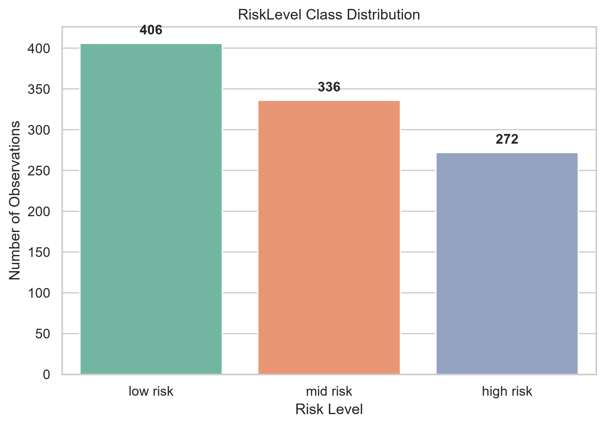
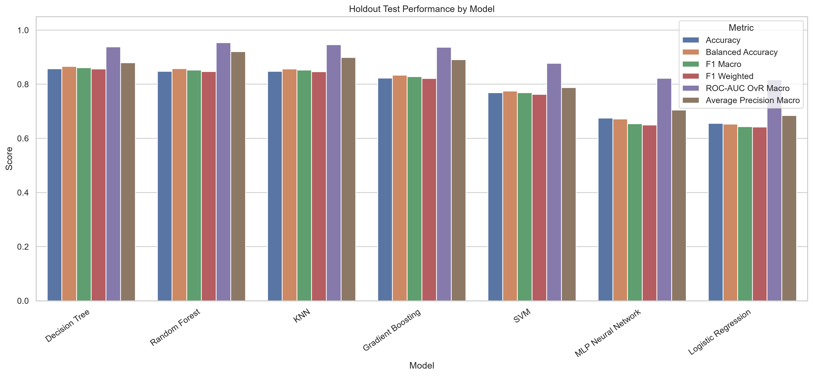
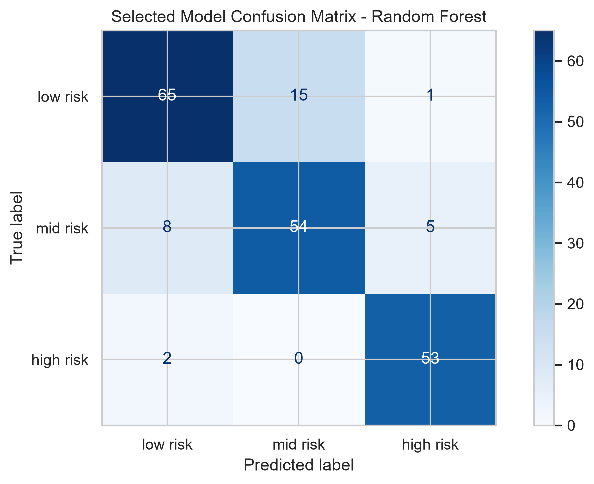
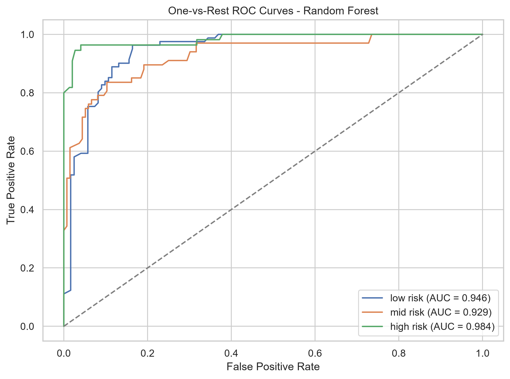
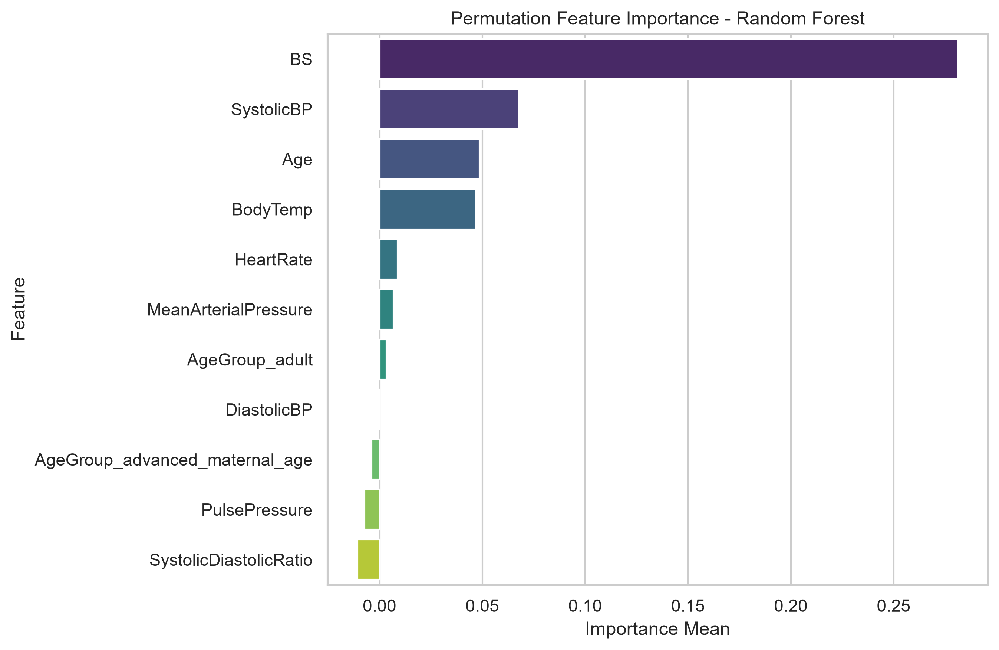
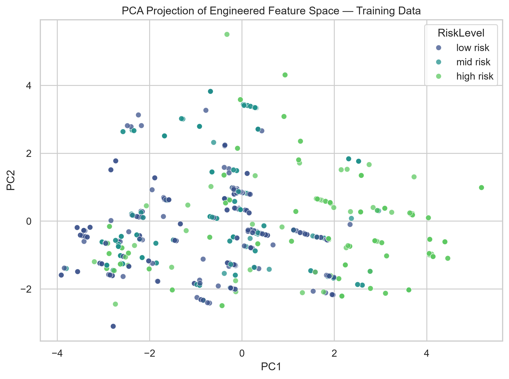

# Predictive Modeling and Data Engineering Pipelines for Maternal Health Risk Stratification

[](https://www.python.org/)
[](https://scikit-learn.org/)
[](https://opensource.org/licenses/MIT)
[]()

> **Academic & Clinical Notice**: This repository contains an educational predictive-modeling and data-engineering project for maternal health risk classification. It is designed as a clinical decision-support framework and should not be used as a standalone diagnostic tool without medical professional oversight.

---

## 📌 Project Overview

Maternal mortality and pregnancy-related complications remain significant global public health challenges. Early risk stratification allows healthcare providers to prioritize care, allocate critical resources, and deliver timely interventions for high-risk expectant mothers.

This project implements an end-to-end, leakage-free machine learning and data engineering pipeline to classify maternal health observations into three risk levels: **Low Risk**, **Mid Risk**, and **High Risk**. Using physiological indicators collected during clinical assessments (e.g., Blood Pressure, Blood Glucose, Body Temperature, Heart Rate, and Age), the pipeline performs automated data quality validation, clinical domain feature engineering, model selection across 7 machine learning algorithms, statistical comparison, and complete model interpretation.

---

## 🔑 Key Features & Pipeline Design

- **Leakage-Free Architecture**: Strictly isolated 80/20 train-test split. Preprocessing transformations (scaling, encoding) are encapsulated within `scikit-learn` pipelines during 5-fold Stratified Cross-Validation to prevent data leakage.
- **Clinical Feature Engineering**: Derives hemodynamically relevant indicators:
  - **Pulse Pressure**: $\text{SystolicBP} - \text{DiastolicBP}$
  - **Mean Arterial Pressure (MAP)**: $\text{DiastolicBP} + \frac{1}{3}(\text{PulsePressure})$
  - **Systolic-to-Diastolic Ratio**: $\frac{\text{SystolicBP}}{\text{DiastolicBP}}$
  - **Age Bins**: Indicators for maternal age groups ($\ge 35$ years categorized as Advanced Maternal Age).
- **Macro F1 Metric Priority**: Optimized primarily for **Macro F1** to ensure balanced diagnostic performance across all three risk categories, avoiding bias toward majority classes.
- **Multi-Model Benchmark (7 Algorithms)**: Systematic evaluation of Logistic Regression (Baseline), Decision Tree, K-Nearest Neighbors (KNN), Support Vector Machine (SVM), Random Forest, Gradient Boosting, and Multi-Layer Perceptron (MLP).
- **Model Interpretability & Error Auditing**: Permutation feature importance analysis, confusion matrix error transition tracking, PCA dimensionality reduction, and K-Means cluster profiling.
- **Reproducible Artifact Generation**: Automatically exports publication-ready tables (`.csv`), figures (`.png`), model metadata (`.json`), and the final fitted model (`.joblib`).

---

## 📊 Dataset & Data Dictionary

The analysis is based on the **Maternal Health Risk Dataset** sourced from the UCI Machine Learning Repository ($N = 1,014$ observations).

### Primary Features

| Feature | Type | Units / Range | Description |
| :--- | :--- | :--- | :--- |
| **Age** | Numeric | Years (10–70) | Age of the pregnant woman |
| **SystolicBP** | Numeric | mmHg (70–160) | Upper value of blood pressure |
| **DiastolicBP** | Numeric | mmHg (49–100) | Lower value of blood pressure |
| **BS** | Numeric | mmol/L (6.0–19.0) | Blood glucose concentration |
| **BodyTemp** | Numeric | °F (98.0–103.0) | Body temperature |
| **HeartRate** | Numeric | bpm (60–90) | Resting heart rate |
| **RiskLevel** | Categorical | Target Class | `low risk` (0), `mid risk` (1), `high risk` (2) |

---

## 🏆 Model Evaluation & Test Results

Models were tuned using 5-fold Stratified Cross-Validation on the training set (80%) and evaluated on the untouched holdout test set (20%, $n = 203$).

### Holdout Performance Benchmark

| Model | Test Accuracy | Macro F1 | Weighted F1 | Precision (Macro) | Recall (Macro) | ROC-AUC (OvR Macro) |
| :--- | :---: | :---: | :---: | :---: | :---: | :---: |
| **Decision Tree** | **85.71%** | **0.8613** | 0.8563 | 0.8581 | 0.8656 | 0.9380 |
| **Random Forest** *(Selected)* | **84.73%** | **0.8524** | 0.8465 | 0.8492 | 0.8574 | **0.9531** |
| **KNN** | 84.73% | 0.8521 | 0.8464 | 0.8488 | 0.8565 | 0.9460 |
| **Gradient Boosting** | 82.27% | 0.8279 | 0.8211 | 0.8240 | 0.8333 | 0.9364 |
| **SVM** | 76.85% | 0.7683 | 0.7627 | 0.7694 | 0.7747 | 0.8772 |
| **MLP Neural Network** | 67.49% | 0.6541 | 0.6494 | 0.6792 | 0.6713 | 0.8221 |
| **Logistic Regression** *(Baseline)* | 65.52% | 0.6431 | 0.6417 | 0.6449 | 0.6525 | 0.8165 |

> **Selected Final Model**: **Random Forest Classifier** was selected for production packaging due to its superior cross-validation stability, high ensemble generalization (ROC-AUC 0.9531), and balanced class-level precision and recall.

---

## 📈 Visualizations & Artifacts

| Target Distribution | Model Comparison |
| :---: | :---: |
|  |  |

| Confusion Matrix (Selected Model) | ROC Curves |
| :---: | :---: |
|  |  |

| Feature Importance | PCA Projection |
| :---: | :---: |
|  |  |

---

## 📁 Repository Structure

```
├── Maternal Health Risk Data Set.csv               # Raw dataset (1,014 rows)
├── Yabets_Maternal_Health_Risk_Script.ipynb        # Main analysis & pipeline notebook
├── Yabets_Maternal_Health_Risk_Project_Report.pdf  # Comprehensive academic project report
├── README.md                                       # Project documentation
├── .gitignore                                      # Ignored build and temporary files
└── outputs_final/                                  # Pipeline outputs & artifacts
    ├── experiment_configuration.json              # Experiment parameters & pipeline config
    ├── models/
    │   ├── maternal_risk_final_model.joblib        # Fitted final model pipeline
    │   └── model_metadata.json                     # Metadata and final metric logs
    ├── figures/                                    # 17 high-resolution visualization charts
    └── tables/                                     # 22 summary CSV & JSON audit tables
```

---

## 🚀 Getting Started

### Prerequisites

Ensure you have Python 3.8+ installed. Recommended packages:

- `numpy`
- `pandas`
- `scikit-learn`
- `matplotlib`
- `seaborn`
- `joblib`
- `scipy`

### Installation

1. **Clone the repository**:
   ```bash
   git clone https://github.com/Yabets-art/Maternal_Health_Risk_Yabets.git
   cd Maternal_Health_Risk_Yabets
   ```

2. **Install requirements**:
   ```bash
   pip install numpy pandas scikit-learn matplotlib seaborn joblib scipy
   ```

3. **Run the Notebook**:
   Launch Jupyter Notebook or JupyterLab and run `Yabets_Maternal_Health_Risk_Script.ipynb` from top to bottom:
   ```bash
   jupyter notebook Yabets_Maternal_Health_Risk_Script.ipynb
   ```

---

## 💻 How to Use the Trained Model

You can load and perform predictions using the saved model artifact in `outputs_final/models/maternal_risk_final_model.joblib`:

```python
import joblib
import pandas as pd

# Load the fitted model pipeline
model_pipeline = joblib.load("outputs_final/models/maternal_risk_final_model.joblib")

# Sample patient observation
sample_patient = pd.DataFrame([{
    "Age": 25,
    "SystolicBP": 130,
    "DiastolicBP": 80,
    "BS": 15.0,
    "BodyTemp": 98.0,
    "HeartRate": 70,
    "PulsePressure": 50,
    "MeanArterialPressure": 96.67,
    "SystolicDiastolicRatio": 1.625,
    "AgeGroup_adult": 1,
    "AgeGroup_advanced_maternal_age": 0
}])

# Predict risk category (0: low risk, 1: mid risk, 2: high risk)
prediction = model_pipeline.predict(sample_patient)
risk_labels = {0: "Low Risk", 1: "Mid Risk", 2: "High Risk"}

print(f"Predicted Risk Level: {risk_labels[prediction[0]]}")
```

---

## 📜 Citation & References

- **Dataset Credit**: Ahmed, M. (2020). *Maternal Health Risk Dataset*. UCI Machine Learning Repository.
- **Project Author**: Yabets Desalegn (Student ID: GSE9850/18)
- **Course**: Data Management and Engineering

---

## 📄 License

This project is open-source under the [MIT License](LICENSE).
